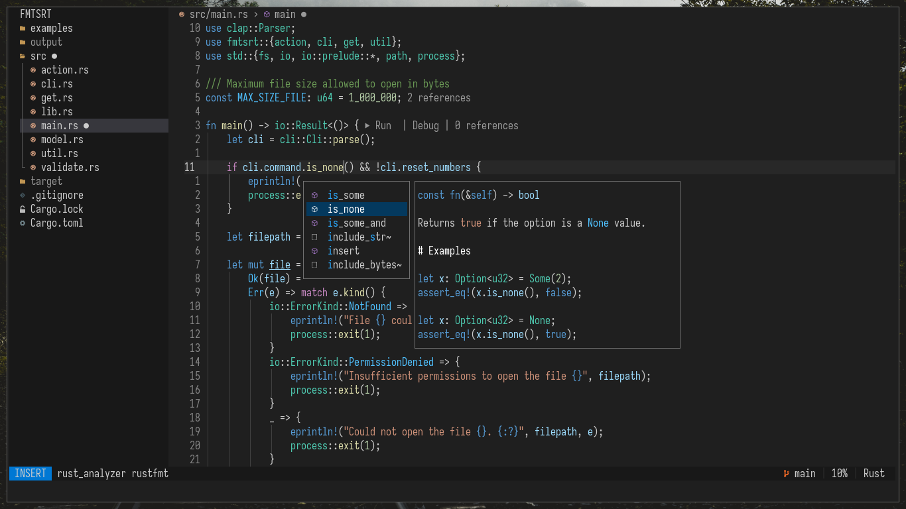
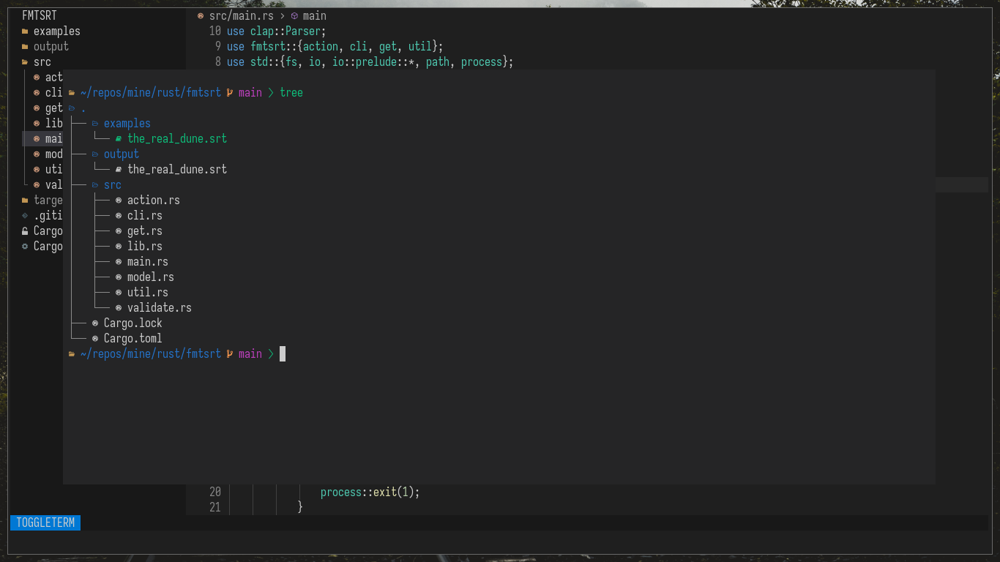
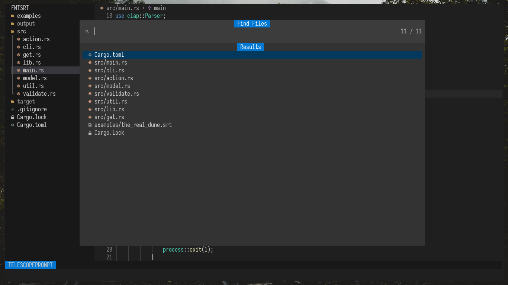
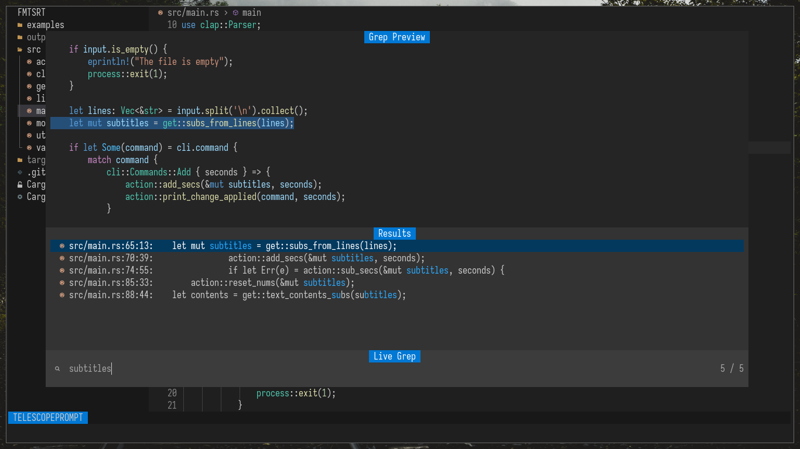
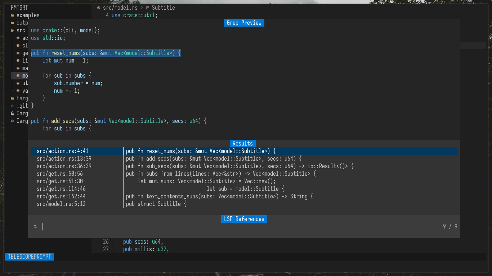
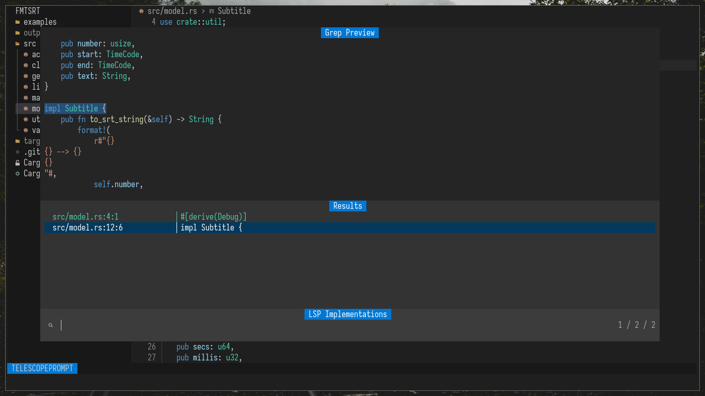

# VSCode Modern theme for Neovim, Dark & Light versions



## Float terminal


## Telescope find files


## Telescope live grep


## Telescope LSP references


## Telescope LSP implementations


# Installation

[lazy.nvim](https://github.com/folke/lazy.nvim)
```lua
{
    "gmr458/vscode_modern_theme.nvim",
    lazy = false,
    priority = 1000,
    config = function()
        require("dark_modern").setup({
            cursorline = true,
            transparent_background = false,
            nvim_tree_darker = true,
        })
        vim.cmd.colorscheme("dark_modern")
    end,
}
```
